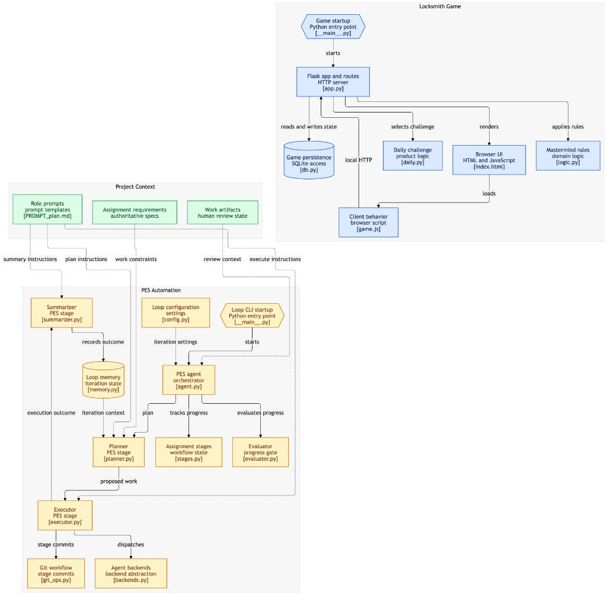

# Assign-4 — Locksmith + Loop Engineering (PES)

**Play the game:** `./script/server` → [http://127.0.0.1:5055/](http://127.0.0.1:5055/)

Mastermind-style **Locksmith** (Flask + SQLite) built with from-scratch
**Plan–Execute–Summary** loop engineering code for CMU DevOps coursework,
inspired by [LoongFlow](https://github.com/baidu-baige/LoongFlow) and the
classroom [Ralph Wiggum tutorial](https://github.com/gwincr11/ralph-wiggum-tutorial).

## Why this shape?

| Source | Idea we kept |
|--------|----------------|
| **Assignment rubric** | AI + loop → nontrivial product; 2 steps × ≥3 stages; loop ≥1 stage; stage commits; `prompts.txt` / `running.md` / `reflection.md` |
| **Ralph loop** | `./loop.sh -m plan\|build`, prompt files, stop on completion promise |
| **LoongFlow PES** | Explicit Plan → Execute → Summary + experiential memory (simplified, coursework-sized) |

Expert performance comes from better **thinking**, not denser retries.

## Architecture (loop vs game)



*Illustration: Project Context (green) feeds **PES Automation / Loop engineering code** (orange), which produces and maintains the **Locksmith Game** (blue).*

### Reading the diagram

| Region (in illustration) | What it is | Repo paths |
|--------------------------|------------|------------|
| **Green — Project Context** | Specs, prompts, and living work artifacts that steer each iteration | `specs/`, `prompts/`, `IMPLEMENTATION_PLAN.md`, `prompts.txt`, `reflection.md`, … |
| **Orange — PES Automation** | The actual **Loop engineering code** (Plan → Execute → Evaluate → Summary) | `loop_engine/` (`agent.py`, `planner.py`, `executor.py`, `evaluator.py`, `summarizer.py`, `memory.py`, `backends.py`, `stages.py`, `git_ops.py`, …), plus `loop.sh` / `config.yaml` |
| **Blue — Locksmith Game** | The **product** built *by* the loop: Flask backend + browser UI | `game/` (`app.py`, `logic.py`, `db.py`, `daily.py`, `templates/`, `static/`) |

### How the Locksmith backend is generated with the loop

1. **Context in** — Stage prompts (`PROMPT_plan.md` / `PROMPT_build.md`, etc.) + assignment specs tell the loop *what* to build next.
2. **Plan** (`planner.py`) — Renders those instructions with experiential memory and writes the prompt into `prompts.txt`.
3. **Execute** (`executor.py` → `backends.py`) — Dispatches the prompt to an agent backend (`dry_run` / `echo` / `copilot`). That is the hand-off where product files under `game/` get created or changed (routes, SQLite, Mastermind rules, UI).
4. **Evaluate** (`evaluator.py`) — Scores the backend with EvalMetric \(S\) so the loop stops on fitness, not vibes.
5. **Summary** (`summarizer.py` → `memory.py`) — Records lessons / \(S\) for the next iteration; stage boundaries are committed via `git_ops.py` / `stages.py`.
6. **Game out** — `python -m game.app` serves the resulting Flask API + UI on `http://127.0.0.1:5055/`.

In short: **orange code runs the loop; blue code is what players hit.** The executor is the bridge that turns proposed work into Locksmith backend/frontend files.

Compact cycle view:

```
┌─────────────────────────────────────────────────────┐
│              PESAgent.run_loop (orange)             │
│  Plan → Execute → Evaluate → Summary → next iter    │
│         │                                           │
│         └── writes/updates ─▶ game/* (blue)         │
│              until <promise>DONE</promise>           │
│              or EvalMetric S ≥ target_score          │
└─────────────────────────────────────────────────────┘
```

## Quick start

```bash
conda activate loop   # optional
pip install -r requirements.txt pytest
chmod +x loop.sh

# Offline smoke test (no LLM)
./loop.sh -m build --backend dry_run -n 1 --no-eval
pytest tests/ -q
python -m loop_engine stage status

# EvalMetric + eval-gated PES automation
./script/eval
./loop.sh automate -n 3 --backend dry_run
```

## Layout

```
loop.sh                 # thin CLI (ralph-compatible flags)
config.yaml             # project goal, stages, backends
loop_engine/            # Loop engineering code (orange in diagram)
game/                   # Locksmith product backend + UI (blue in diagram)
docs/                   # architecture illustration for this README
prompts/                # mode prompt templates
specs/                  # product + rubric specs
tests/                  # offline unit tests
prompts.txt             # auto-appended agent prompt history
running.md              # how a TA runs things
reflection.md           # SE reflection paragraph
STAGE_HISTORY.md        # grader map: stage commit → artifacts
IMPLEMENTATION_PLAN.md  # living plan the loop updates
AGENTS.md               # operational agent notes
```

## Assignment workflow

See `STAGE_HISTORY.md` for a grader map of which commit delivered which stage
artifact (including honest notes where Step 2 code landed vs stage names).
Also see `specs/00-assignment-rubric.md` and `running.md`. Short version:

1. `stage start/complete` around **specify → review → plan → build** for `step1_base`
2. Use `./loop.sh -m plan` / `./loop.sh -m build` for the looped stages
3. Repeat for `step2_extension`
4. Keep `prompts.txt`, `running.md`, `reflection.md` current

## Agent backends

| Backend | Use when |
|---------|----------|
| `dry_run` | Testing the loop itself (default) |
| `echo` | Write prompt to `.loop_workspace/next_prompt.md` for manual paste |
| `copilot` | GitHub Copilot CLI (class tutorial) |

```bash
./loop.sh -m plan --backend echo -n 1
./loop.sh -m build --backend copilot
```

## License / provenance

Original coursework code. Concepts referenced from LoongFlow (Apache-2.0) and
the Ralph Wiggum loop pattern; this tree is **not** a fork of either repo.
